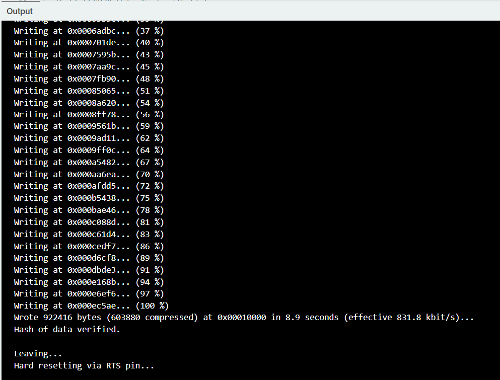
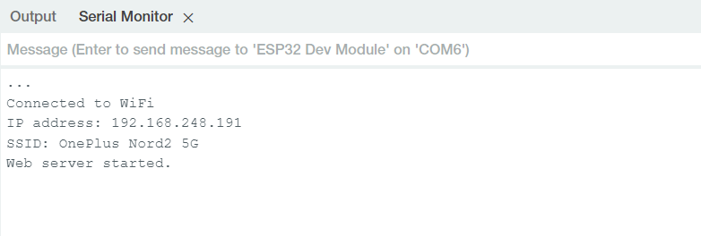
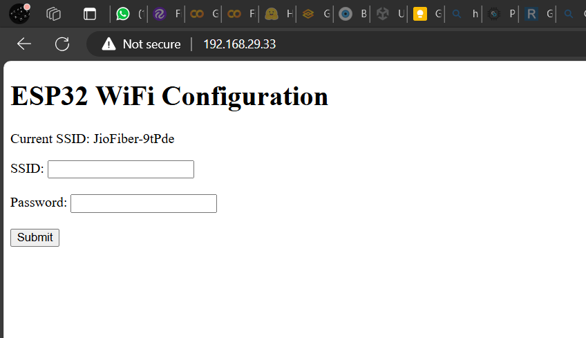

# ESP32 SSID configuration using web interface

A web based SSID and password configuration for ESP32 to avoid reburning the board again and again.

## Setup

- Include necessary libraries:
Ensure you have the required libraries installed, such as WiFi.h for WiFi functionality and WebServer.h for creating the web server.

- Define SSID and password variables:
Store the SSID and password in a way that they can be updated, such as in EEPROM or Preferences.

- Create HTML for the web page:
Write the HTML code for the web page where users can enter the new SSID and password.

- Handle form submissions:
Write the code to handle form submissions and update the SSID and password.

- Upload and Test
Upload the code to your ESP32.
Use the Arduino IDE or PlatformIO to upload the code to your ESP32.

- Connect to the ESP32.
If the ESP32 fails to connect to the configured WiFi, it will start in AP mode. Connect to the "ESP32-Config" network.

- Access the configuration page.
Open a browser and navigate to http://192.168.29.33 to access the configuration page.

Enter new credentials.
Input the new SSID and password, then submit the form. The ESP32 will save the new credentials and reboot.

## Solution code

```cpp

#include <WiFi.h>
#include <WebServer.h>
#include <Preferences.h>

Preferences preferences;
WebServer server(80);

String htmlPage = R"rawliteral(
<!DOCTYPE HTML><html>
<head>
  <title>ESP32 WiFi Config</title>
</head>
<body>
  <h1>ESP32 WiFi Configuration</h1>
  <p>Current SSID: %CURRENT_SSID%</p>
  <form action="/setWiFi" method="POST">
    <label for="ssid">SSID:</label>
    <input type="text" id="ssid" name="ssid"><br><br>
    <label for="password">Password:</label>
    <input type="password" id="password" name="password"><br><br>
    <input type="submit" value="Submit">
  </form>
</body>
</html>
)rawliteral";

void handleRoot() {
  String currentSSID = WiFi.SSID();
  String page = htmlPage;
  page.replace("%CURRENT_SSID%", currentSSID);
  Serial.println("Serving root page...");
  server.send(200, "text/html", page);
}

void handleSetWiFi() {
  if (server.hasArg("ssid") && server.hasArg("password")) {
    String ssid = server.arg("ssid");
    String password = server.arg("password");

    preferences.putString("ssid", ssid);
    preferences.putString("password", password);

    server.send(200, "text/html", "Credentials saved. Rebooting...");
    Serial.println("Credentials saved. Rebooting...");

    delay(1000);
    ESP.restart();
  } else {
    server.send(400, "text/html", "Bad Request");
    Serial.println("Bad Request: Missing SSID or password.");
  }
}

void setup() {
  Serial.begin(115200);

  preferences.begin("wifi-config", false);

  String ssid = preferences.getString("ssid", "JioFiber-9tPde");
  String password = preferences.getString("password", "vjng9977");

  WiFi.begin(ssid.c_str(), password.c_str());

  Serial.print("Connecting to WiFi...");
  while (WiFi.status() != WL_CONNECTED) {
    delay(500);
    Serial.print(".");
  }

  Serial.println("\nConnected to WiFi");
  Serial.print("IP address: ");
  Serial.println(WiFi.localIP());
  Serial.print("SSID: ");
  Serial.println(WiFi.SSID());

  server.on("/", handleRoot);
  server.on("/setWiFi", HTTP_POST, handleSetWiFi);
  server.begin();
  Serial.println("Web server started.");
}

void loop() {
  if (WiFi.status() == WL_CONNECTED) {
    server.handleClient();
  }
}

```

### Screenshots




